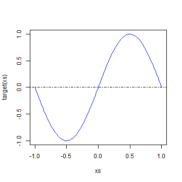
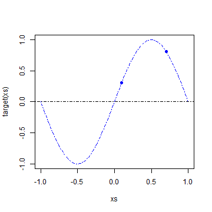
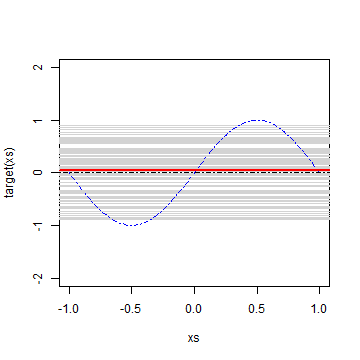

<script type="text/x-mathjax-config">
MathJax.Hub.Register.StartupHook("TeX Jax Ready",function () {
  MathJax.Hub.Insert(MathJax.InputJax.TeX.Definitions.macros,{
    cancel: ["Extension","cancel"],
    bcancel: ["Extension","cancel"],
    xcancel: ["Extension","cancel"],
    cancelto: ["Extension","cancel"]
  });
});
</script>

Bias-Variance
========================================================

This document is based entirely on the Learning from Data [video lectures](http://work.caltech.edu/library/).

Introduction
--------------

We have some dataset ${\cal D}$ with $N$ observations $x_1, x_2, \ldots, x_N$ each having a class $y_i$, $x_i \in {\cal X}, y_i \in {\cal Y}$.

+ Assumption 1: The **observations** $x_i$ were generated by a probability distribution $P(x)$
+ Assumption 2: The **classifications** $y_i$ were generated by an unkown **target function** $f:{\cal X} \rightarrow {\cal Y}$ plus some noise. We will model this assuming an unknown probability distribution $P(y|x)$.
+ Assumption 3: The target function may be approximated by one of the possible hypothesis within the chosen **hypothesis set** ${\cal H}$ (which might be more or less expressive).

Our **learning algorithm** ${\cal L}$ (whatever it is) will receive ${\cal D}$ a dataset created by $P(x)$ and $P(y|x)$ and also ${\cal H}$. Notice that ${\cal D} = \{(x_i,y_i)\} \sim P(x).P(y|x) = P(x,y)$.

The hypothesis set plus the learning algorithm are usually referred as the **learning model**.

With that information, ${\cal L}$ will output a **final hypothesis** $g \in {\cal H}$. 

Hopefully, for a new $x \in {\cal X}$ , $x \sim P(x)$, we will have $f(x) \approx g(x)$.

One common feature for learning algorithms is an **error function** $e(g(x_i),y_i)$ that measures how far the final hypothesis proposal $g(x_i)$ is from the real value $y_i$. This error measure is critical to evaluate and select different hypothesis from ${\cal H}$.

Let's denote:

+ $E_{in}(h)$, the **in sample error**, as the error measured from the sample using hypothesis $h$.
+ $E_{out}(h)$, the **out of sample error** as the error measured from a new sample (not used in the learning process) using hypothesis $h$.

Usually both errors are computed as the mean of the error for each observation in the respective sample. One common error function is the squared error, i.e., $e(h(x),y) = (h(x)-y)^2$.

A good learning model is able to _generalize_, i.e., $E_{out}(g) \approx E_{in}(g)$ and to _approximate_, i.e., $E_{in}(g) \approx 0$. This means that it is able to _learn_: $E_{out}(g) \approx 0$

Definition: A hypothesis $h_1$ **overfits** in relation to $h_2$ iff $E_{in}(h_1) \lt E_{in}(h_2) \land E_{out}(h_1) \gt E_{out}(h_2)$

There's a tradeoff between approximation and generalization. A complex learning model has better chance to approximate the target function but will tend to overfit the dataset, i.e., a complex model will tend to output hypothesis with very small $E_{in}$ but larger $E_{out}$. A less complex learning model has better chance to generalize but will tend to underfit the dataset.

Bias-Variance Analysis
----------------------

Bias-Variance analysis is a way to quantify this tradeoff. This analysis requires real-valued $y_i$ and uses squared error.

The idea is to decompose $E_{out}$ into (a) how well ${\cal H}$ can approximate the target function $f$; (b) how well can we zoom on a good $h \in {\cal H}$. 

Let's denote $g^{({\cal D})}$ the final hypothesis found by the learning model based on the train dataset ${\cal D}$, then

$$E_{out}(g^{({\cal D})}) = \mathbb{E}_x \left[ (g^{({\cal D})}(x) - f(x))^2 \right]$$

i.e., the out of sample error is the expected value of the square error for the entire space of observations.

The expected value of the out sample error for the entire space of datasets:

$$
\begin{array}{lcl}
\mathbb{E}_{{\cal D}} \left[ E_{out}(g^{({\cal D})}) \right] & = & \mathbb{E}_{{\cal D}} \left[ \mathbb{E}_x \left[ (g^{({\cal D})}(x) - f(x))^2 \right] \right] \\
 & = & \mathbb{E}_x \left[ \mathbb{E}_{{\cal D}} \left[ (g^{({\cal D})}(x) - f(x))^2 \right] \right] \\
\end{array}$$

To evaluate 

$$\mathbb{E}_{{\cal D}} \left[ (g^{({\cal D})}(x) - f(x))^2 \right]$$

we define the 'average' hypothesis 

$$\overline{g}(x) = \mathbb{E}_{{\cal D}} \left[ g^{({\cal D})}(x) \right]$$

and approximate it by having many datasets ${\cal D}_1, {\cal D}_2 \ldots {\cal D}_K$

$$\overline{g}(x) \approx \frac{1}{K} \sum_{k=1}^K g^{({\cal D}_k)}(x)$$

Then,

$$
\begin{array}{lcl}
\mathbb{E}_{{\cal D}} \left[ (g^{({\cal D})}(x) - f(x))^2 \right] & = & \mathbb{E}_{{\cal D}} \left[ (g^{({\cal D})}(x) - \overline{g}(x) + \overline{g}(x) - f(x))^2 \right] \\
 & = & \mathbb{E}_{{\cal D}} \left[ (g^{({\cal D})}(x) - \overline{g}(x))^2 + (\overline{g}(x) - f(x))^2 + 2(g^{({\cal D})}(x) - \overline{g}(x)) (\overline{g}(x) - f(x)) \right] \\
 & = & \mathbb{E}_{{\cal D}} \left[ (g^{({\cal D})}(x) - \overline{g}(x))^2 + (\overline{g}(x) - f(x))^2 \right] + \cancelto{0}{\mathbb{E}_{{\cal D}} \left[ 2(g^{({\cal D})}(x) - \overline{g}(x)) (\overline{g}(x) - f(x)) \right]} \\
 & = & \mathbb{E}_{{\cal D}} \left[ (g^{({\cal D})}(x) - \overline{g}(x))^2 + (\overline{g}(x) - f(x))^2 \right] \\
 & = & \mathbb{E}_{{\cal D}} \left[ (g^{({\cal D})}(x) - \overline{g}(x))^2 \right] + (\overline{g}(x) - f(x))^2
\end{array}$$

Notice that the last term was eliminated because $\overline{g}(x) - f(x)$ is a constant concerning ${\cal D}$ and:

$$
\mathbb{E}_{{\cal D}} \left[ g^{({\cal D})}(x) - \overline{g}(x) \right]  =  \mathbb{E}_{{\cal D}} \left[ g^{({\cal D})}(x) \right] - \mathbb{E}_{{\cal D}} \left[ \overline{g}(x) \right] 
 = \overline{g}(x) - \overline{g}(x) = 0
$$

So, we are left with two terms. We denote them by variance and bias:

$$\mathbb{E}_{{\cal D}} \left[ (g^{({\cal D})}(x) - f(x))^2 \right] = \underbrace{\mathbb{E}_{{\cal D}} \left[ (g^{({\cal D})}(x) - \overline{g}(x))^2 \right]}_{\text{variance(x)}} + \underbrace{(\overline{g}(x) - f(x))^2}_{\text{bias(x)}}$$

The bias term is interpreted as the structural difference between our model's best hypothesis and the true real target function. Even if we have huge amounts of different dataset to produce a very reliable average hypothesis, that error will still be greater than zero (unless luckily the target function is included in ${\cal H}$ and the learning algorithm is able to select it).

Therefore, 

$$
\begin{array}{lcl}
\mathbb{E}_{{\cal D}} \left[ E_{out}(g^{({\cal D})}) \right] & = & \mathbb{E}_x \left[ \mathbb{E}_{{\cal D}} \left[ (g^{({\cal D})}(x) - f(x))^2 \right] \right] \\
 & = & \mathbb{E}_x \left[ \text{variance(x)} + \text{bias(x)} \right] \\
 & = & \text{variance} + \text{bias}
\end{array}$$

Example: sine target
---------------------

Let's make the target function, $f:[-1,-1] \rightarrow \mathbb{R}$, $f(x) = sin(\pi x)$.


```r
target <- function(x) {
  sin(pi*x)
}
xs <- seq(-1,1,length.out=100)
plot(xs, target(xs), type="l", col="blue")
abline(h=0, lty=4)
```

 


And provide datasets ${\cal D}$ with only two samples $\{(x_1,y_1), (x_2,y_2)\}, y_i = f(x_i)$. Eg:


```r
set.seed(101)
D <- data.frame(x=c(.1,.7), y=target(c(.1,.7)))

plot(xs, target(xs), type="l", col="blue", lty=4) # remember that the target is unknown
abline(h=0, lty=4)
points(D$x,D$y,col="blue",pch=19)
```

 


Let's work with two different hypothesis sets:

+ ${\cal H}_0$ where $h(x) = b$
+ ${\cal H}_1$ where $h(x) = ax + b$

Just as an example, let's assume that somehow we got $g_0(x) = 0$ from ${\cal H}_0$ and $g_1(x) = x$ from ${\cal H}_1$:


```r
g0 <- function(x) {x-x} # hack to fool R
g1 <- function(x) {x}
```


Let's plot the errors that these two specifc hypothesis make (in relation to the true target function) and compute $E_{out}$ for each one:


```r
error <- function(gs, ys) {
  sum((gs-ys)^2)/length(gs)
}

h0.e.out <- error(g0(xs), target(xs))
h1.e.out <- error(g1(xs), target(xs))

# function to fill the difference of two functions in a plot
#  xs: the x values to make the plot
#  f1, f2: the two functions to plot their differences
fill.difference <- function(xs, f1, f2, col="yellow") {
  polygon(c(xs,rev(xs)), 
          c(pmax(f1(xs),f2(xs)), pmin(f1(rev(xs)),f2(rev(xs)))), 
          col=col)
}

par(mfcol=c(1,2))
plot(xs, target(xs), type="l", col="blue", lty=4, main="g0(x)=0")
abline(h=0, lty=4)
fill.difference(xs, target, g0)
points(xs, g0(xs), type="l", col="black", lwd=2)
mtext(paste0("E_out = ", signif(h0.e.out, digits=2)), 3)

plot(xs, target(xs), type="l", col="blue", lty=4, main="g1(x)=x")
abline(h=0, lty=4)
fill.difference(xs, target, g1)
points(xs, g1(xs), type="l", col="black", lwd=2)
mtext(paste0("E_out = ", signif(h1.e.out, digits=2)), 3)
```

 


Let's start with ${\cal H}_0$. For each pair of points $(x_1,y_1), (x_2,y_2)$, the hypothesis $g \in {\cal H}_0$ that minimizes the error is $g_0(x) = \frac{x_1+x_2}{2}$, i.e., pass the horizontal line between the two points.

Let's generate lots of datasets with two points and plot which hypothesis were returned. At the same time, lets compute $\overline{g_0}(x)$


```r
plot(xs, target(xs), ylim=c(-2,2), type="l", col="blue", lty=4)
abline(h=0, lty=4)

g0.param.b <- 0 # parameter for the average hypothesis g0(x) = b

runs <- 100
for (i in 1:runs) {
  Dx <- runif(2,-1,1)
  D <- data.frame(x=Dx, y=target(Dx))
  
  abline(h=mean(D$x), col="lightgray")
  
  g0.param.b <- g0.param.b + mean(D$x)
}
points(xs, target(xs), type="l", col="blue", lty=4)
     
g0.param.b <- g0.param.b / runs
abline(h=g0.param.b, col="red", lwd=2) # show average hypothesis
```

 


And let's do the same for ${\cal H}_1$. Here the best fit for is the line defined by those two points.


```r
plot(xs, target(xs), ylim=c(-2,2), type="l", col="blue", lty=4)
abline(h=0, lty=4)

g1.param.a <- 0 # parameters for the average hypothesis g1(x) = ax+b
g1.param.b <- 0

runs <- 100
for (i in 1:runs) {
  Dx <- runif(2,-1,1)
  D <- data.frame(x=Dx, y=target(Dx))  # create a new dataset D
  
  slope <- (D$y[1]-D$y[2])/(D$x[1]-D$x[2])
  intercept <- D$y[1] - slope * D$x[1]
  abline(intercept, slope, col="lightgray")
  
  g1.param.a <- g1.param.a + slope
  g1.param.b <- g1.param.b + intercept
}
points(xs, target(xs), type="l", col="blue", lty=4)

g1.param.a <- g1.param.a / runs
g1.param.b <- g1.param.b / runs
abline(g1.param.b, g1.param.a, col="red", lwd=2) # show average hypothesis
```

 


So right now we got the average hypothesis for both hypothesis sets, ${\cal H}_0$ and ${\cal H}_1$. They are:


```r
g0.param.b
```

```
[1] 0.0474
```

```r
g1.param.a
```

```
[1] 0.7816
```

```r
g1.param.b
```

```
[1] -0.1103
```


I.e., 

+ $\overline{g_0}(x) =$ 0.047
+ $\overline{g_1}(x) =$ 0.78 $x +$ -0.11


```r
g0_avg <- function (x) {
  g0.param.b * (x^0) # again a R hack
}

g1_avg <- function (x) {
  g1.param.a * x + g1.param.b
}
```


To compute the bias of models ${\cal H}_0$ and ${\cal H}_1$:

$$\text{bias}_{{\cal H}_i} = \mathbb{E}_x \left[ (\overline{g_i}(x) - f(x))^2 \right]$$

Let's approximate in R:


```r
xs <- seq(-1,1,length.out=10000)
bias.h0 <- error(g0_avg(xs), target(xs))
bias.h0
```

```
[1] 0.5022
```

```r
bias.h1 <- error(g1_avg(xs), target(xs))
bias.h1
```

```
[1] 0.2182
```


To compute the variance of both models:

$$\text{variance}_{{\cal H}_i} = \mathbb{E}_x \left[ \mathbb{E}_{{\cal D}} \left[ (g_i^{({\cal D})}(x) - \overline{g_i}(x))^2 \right] \right]$$

Let's again approximate in R:


```r
xs       <- seq(-1,1,length.out=1000)
datasets <- 100 # how many different datasets will be checked

variance.h0 <- 0
variance.h1 <- 0

for(x in xs) {              # for each observation
  
  gs.h0 <- rep(NA,datasets) # (g^D(x)-g0_avg(x))^2, for a given D
  gs.h1 <- rep(NA,datasets) # (g^D(x)-g1_avg(x))^2, for a given D

  for(d in 1:datasets) {    # for each dataset
    Dx <- runif(2,-1,1)
    D <- data.frame(x=Dx, y=target(Dx))  # create a new dataset D
  
    # process H0:
    gs.h0[d] <- (mean(D$x) - g0_avg(x))^2
    
    # process H1:
    a <- (D$y[1]-D$y[2])/(D$x[1]-D$x[2])
    b <- D$y[1] - a * D$x[1]
    gs.h1[d] <- ((a*x + b) - g1_avg(x))^2
  } 
  
  variance.h0 <- variance.h0 + mean(gs.h0) # mean(gs.h0) == E_D(...)
  variance.h1 <- variance.h1 + mean(gs.h1) # mean(gs.h0) == E_D(...)
}

variance.h0 <- variance.h0 / length(xs) # E_x(...)
variance.h0
```

```
[1] 0.1685
```

```r
variance.h1 <- variance.h1 / length(xs) # E_x(...)
variance.h1
```

```
[1] 1.693
```


To confirm these results we can compute $E_{out}$ directly by using expression:

$$E_{out}(g_i) = \mathbb{E}_x \left[ \mathbb{E}_D \left[ (g_i^{({\cal D})}(x) - f(x))^2 \right] \right], g_i \in {\cal H}_i$$


```r
xs       <- seq(-1,1,length.out=1000)
h0.e.out <- 0
h1.e.out <- 0

datasets <- 100 # how many different datasets will be checked

for(x in xs) {              # for each observation
  
  gs.h0 <- rep(NA,datasets) # (g^D(x)-target(x))^2, for a given D
  gs.h1 <- rep(NA,datasets) # (g^D(x)-target(x))^2, for a given D

  for(d in 1:datasets) {    # for each dataset
    Dx <- runif(2,-1,1)
    D <- data.frame(x=Dx, y=target(Dx))  # create a new dataset D
  
    # process H0:
    gs.h0[d] <- (mean(D$x) - target(x))^2
    
    # process H1:
    a <- (D$y[1]-D$y[2])/(D$x[1]-D$x[2])
    b <- D$y[1] - a * D$x[1]
    gs.h1[d] <- ((a*x + b) - target(x))^2
  } 
  
  h0.e.out <- h0.e.out + mean(gs.h0) # mean(gs.h0) == E_D(...)
  h1.e.out <- h1.e.out + mean(gs.h1) # mean(gs.h0) == E_D(...)
}

h0.e.out <- h0.e.out / length(xs) # E_x(...)
h0.e.out  # should be approx to bias.h0 + variance.h0
```

```
[1] 0.6682
```

```r
bias.h0 + variance.h0
```

```
[1] 0.6707
```

```r
h1.e.out <- h1.e.out / length(xs) # E_x(...)
h1.e.out  # should be approx to bias.h1 + variance.h1
```

```
[1] 1.882
```

```r
bias.h1 + variance.h1
```

```
[1] 1.911
```


With more computation steps, these values would have come closer.

Surprinsingly, the simpler ${\cal H}_0$ performs better than ${\cal H}_1$. The moral of this story is that we should _choose a model by matching the model's complexity to the data resources, not the (assumed) target complexity_.

Analytic Solution for the Bias
-----------------

Just as a curiosity, the bias has a not too hard analytic solution.

$$\text{bias}_{{\cal H}_i} = \mathbb{E}_x \left[ (\overline{g_i}(x) - f(x))^2 \right]$$

The expected value is defined as:

$$\mathbb{E}(x) = \int_a^b x p(x) dx$$

In this case, $f(x)=sin(\pi x)$, $a=-1, b=1$ and $p(x)$ is constant. That means that $p(x)=\frac{1}{b-a}=1/2$ since the entire probability space (going from -1 to 1) must add up to $1$.

So:

$$\text{bias}_{{\cal H}_i} = \frac{1}{2} \int_{-1}^{1} (\overline{g_i}(x) - sin(\pi x))^2 dx$$

For ${\cal H}_0$ the average hypothesis is $\overline{g_i}(x) = 0$ (our simulated value came pretty close to it), and so:

$$\text{bias}_{{\cal H}_0} = \frac{1}{2} \int_{-1}^{1} (sin(\pi x))^2 dx = 0.5$$

which our approximation also came close.

The integral can be computed [here](http://www.wolframalpha.com/input/?i=1%2F2+*+integrate+%28sin+%28pi*x%29%29%5E2+dx+from+x%3D-1+to+1).

For ${\cal H}_1$ the average hypothesis is $\overline{g_i}(x) = \frac{\pi x}{4}$ (not sure how to get this value without the simulation clue):

$$\text{bias}_{{\cal H}_1} = \frac{1}{2} \int_{-1}^{1} (sin(\pi x) - \frac{\pi x}{4})^2 dx = \frac{\pi^2}{48} \approx 0.2056$$

The integral can be computed [here](http://www.wolframalpha.com/input/?i=1%2F2*+integrate+%28sin+%28pi*x%29-pi*x%2F4%29%5E2+dx+from+x%3D-1+to+1).

